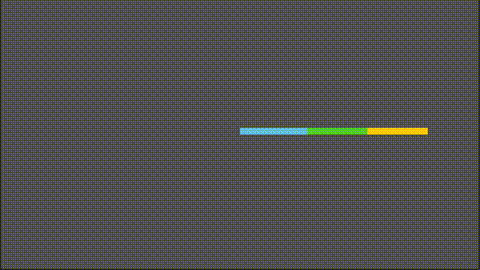
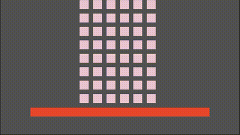
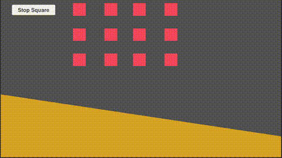

# RigidBodyXPBD

RigidBodyXPBD 是一个基于位置的动力学（Position-Based Dynamics, PBD）物理引擎，专注于刚体模拟。该项目使用 Unity 引擎开发，旨在提供高效、稳定的物理模拟。

## 项目结构

- **Assets/Scripts**: 包含所有的脚本文件。
  - **RigidBodyEntry.cs**: 定义了刚体的状态和行为。
  - **PolygonRBEntry.cs**: 扩展了刚体，支持多边形形状。
  - **PhysicalEngine**: 包含物理引擎的核心组件和约束处理。
    - **PositionConstraint.cs**: 处理位置约束。
    - **PositionBasedDynamics.cs**: 核心物理引擎，处理物理更新和约束求解。
    - **PolygonCollisionDetector.cs**: 使用分离轴定理（SAT）检测多边形碰撞。
    - **FixedPosConstraint.cs**: 处理固定位置约束。
    - **EffectiveMassElement.cs**: 计算刚体在特定点的有效质量。
    - **CollisionConstraint.cs**: 定义碰撞约束。
    - **CollideCheck.cs**: 提供简单的碰撞检测方法。

## 主要功能

- **刚体模拟**: 支持刚体的速度、位置、旋转等属性的模拟。
- **多边形碰撞检测**: 使用分离轴定理（SAT）进行多边形间的碰撞检测。
- **位置和角度约束**: 支持位置和角度的约束处理，确保物理模拟的稳定性。

## 使用方法

1. 克隆项目到本地。
2. 在 Unity 中打开项目。
3. 在场景中添加 `PolygonRBEntry` 组件到 GameObject 上，增加顶点，并点击生成。
4. 配置刚体的属性，如质量、惯性、摩擦系数等。
5. 运行场景，观察物理模拟效果。
6. 如果需要开启多边形碰撞检测的调试显示，可以在 `PolygonCollisionDetector` 脚本中找到相关的调试代码，并取消注释。具体步骤如下：
   - 打开 `PolygonCollisionDetector.cs` 文件。
   - 找到调试显示相关的代码块
   - 取消注释这些代码块，以启用调试显示功能。

## 贡献

欢迎贡献代码和提出建议。请提交 Pull Request 或在 Issue 中讨论。

## 许可证

该项目使用 MIT 许可证。

## 参考

- https://github.com/felipeek/raw-physics
- https://github.com/oskaralund/pbd2d
- https://github.com/InteractiveComputerGraphics/PositionBasedDynamics
- https://github.com/nobuo-nakagawa/pbd_rb
- https://github.com/erincatto/box2d-lite
- https://github.com/erincatto/box2d

