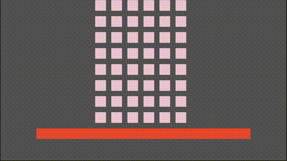
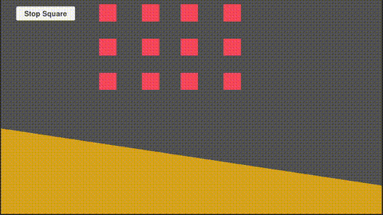

# RigidBodyXPBD

RigidBodyXPBD is a position-based dynamics (PBD) physics engine focused on rigid body simulation. Developed with the Unity engine, this project aims to offer efficient and stable physics simulation.

## Project Structure

- **Assets/Scripts**: Contains all script files.
  - **RigidBodyEntry.cs**: Defines the state and behavior of rigid bodies.
  - **PolygonRBEntry.cs**: Extends rigid bodies to support polygon shapes.
  - **PhysicalEngine**: Contains core components and constraint handling of the physics engine.
    - **PositionConstraint.cs**: Manages positional constraints.
    - **PositionBasedDynamics.cs**: The core physics engine handling updates and constraint resolution.
    - **PolygonCollisionDetector.cs**: Uses the Separating Axis Theorem (SAT) for polygon collision detection.
    - **FixedPosConstraint.cs**: Handles fixed position constraints.
    - **EffectiveMassElement.cs**: Calculates the effective mass at specific points on rigid bodies.
    - **CollisionConstraint.cs**: Defines collision constraints.
    - **CollideCheck.cs**: Provides simple collision detection methods.

## Main Features

- **Rigid Body Simulation**: Simulates properties such as velocity, position, and rotation of rigid bodies.
- **Polygon Collision Detection**: Uses the Separating Axis Theorem (SAT) to detect collisions between polygons.
- **Position and Angle Constraints**: Ensures simulation stability by handling positional and angular constraints.
- **Parallel Processing**: Supports parallel collision detection to boost performance.

## Usage

1. Clone the project to your local machine.
2. Open the project in Unity.
3. Add the `RigidBodyEntry` or `PolygonRBEntry` component to a GameObject in the scene.
4. Configure rigid body properties such as mass, inertia, and friction.
5. Run the scene to observe the physics simulation.
6. To enable debug display for polygon collision detection, open the `PolygonCollisionDetector.cs` file and uncomment the debug code regions.

## Contributing

Contributions and suggestions are welcome. Please submit a Pull Request or open an Issue for discussions.

## License

This project is licensed under the MIT License.

## References

- https://github.com/felipeek/raw-physics
- https://github.com/oskaralund/pbd2d
- https://github.com/InteractiveComputerGraphics/PositionBasedDynamics
- https://github.com/nobuo-nakagawa/pbd_rb
- https://github.com/erincatto/box2d-lite
- https://github.com/erincatto/box2d
